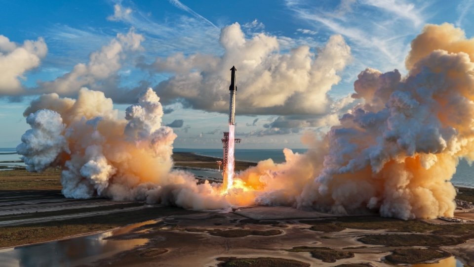

# SpaceX Live Wallpaper

A native macOS menu bar app that plays a cinematic SpaceX launch wallpaper behind your desktop icons, with an optional matching macOS wallpaper and lock-screen background.

Two animated photographs blend into launch footage and back again. The included film is **4K, 30 fps, 50 seconds, and silent**.



## Download

- **[Download the app](https://github.com/keskinonur/spacex-live-wallpaper/releases/latest/download/SpaceX-Live-Wallpaper-macOS-arm64.zip)**: a self-contained Apple Silicon `.app`, including the video.
- **[Download the 4K video](https://github.com/keskinonur/spacex-live-wallpaper/releases/latest/download/SpaceX-4K-Loop.mp4)**: use it with another video wallpaper player.
- [Release notes and checksums](https://github.com/keskinonur/spacex-live-wallpaper/releases/latest).

The repository also contains the complete `SpaceX Live Wallpaper.app` bundle and `SpaceX-4K-Loop.mp4`. No Git LFS or external media download is needed after cloning.

## Run

1. Download and extract the app ZIP.
2. Move **SpaceX Live Wallpaper.app** to **Applications** and open it.
3. At first launch, choose **Apply to Both** to use the same film for the desktop and native macOS wallpaper/screen saver, or **Desktop Only** for app playback alone.
4. Use **SpaceX** in the menu bar to pause, resume, preview, apply the native wallpaper later, restore your previous system wallpaper, or quit.

The app is locally ad-hoc signed, not Developer ID signed or notarized. macOS may block a downloaded copy. If you choose to allow it, use the per-app **Open Anyway** control in System Settings → Privacy & Security after attempting to open it. Alternatively, build it locally using the instructions below. No system-wide security change is needed.

In **Desktop Only** mode, quitting reveals the system wallpaper without changing its settings. After **Apply to Both**, the native SpaceX selection persists when the app quits. Choose **Restore Previous System Wallpaper… → Restore & Quit** to return to the saved selection. If you have since selected another wallpaper, the app refuses to overwrite it. To launch at login, add the app yourself under System Settings → General → Login Items after moving it to a permanent location.

## Motion

The photographs use a cinemagraph treatment: the smoke plumes slowly roll upward and outward while warm engine light gently pulses. A feathered exclusion protects the rocket and tower from local distortion, and the ground stays fixed. An eased 1.2% camera zoom provides a small change in perspective across each 18-second photo scene.

These are artistic effects synthesized from still photographs, not recorded smoke motion or a physical launch simulation. The actual video segment retains the original footage's motion. Two-second crossfades join the scenes and close the loop.

The design keeps the original colors, avoids text overlays and added objects, and uses fractional-pixel rendering to prevent stepped camera motion. Pause is always available in the menu bar.

## Behavior

- Runs behind desktop icons and lets mouse input pass through.
- Plays locally using AVFoundation, with no account, network connection, or external runtime required.
- Pauses on sleep, screen lock, an inactive user session, and Low Power Mode.
- Does not prevent display sleep.
- Preview playback follows the same menu-bar Pause/Resume controls and power policy.
- Fills the display, cropping the edges on screens that are not 16:9.
- Creates one player per connected display and rebuilds them when display configuration changes.

## Matching desktop and lock screen

**Apply to Desktop & Lock Screen…** registers the same 50-second film in the local macOS Aerial catalog and selects it as a linked wallpaper and screen saver. The app continues looping on the desktop; macOS handles the native background when the desktop player pauses on lock.

This gives both surfaces matching content, **not frame-synchronized playback**. macOS decides whether the lock/password screen animates or shows a still frame. An uninterrupted transition at the exact same video position is not guaranteed. This is not a time-of-day `.heic` wallpaper.

Native integration is limited to **macOS 27**, with the linked, all-displays wallpaper layout. If the catalog is missing or you use separate Space/display choices, the app shows an error and keeps desktop-only playback available. Select one linked Aerial wallpaper in System Settings before retrying. Other macOS versions retain desktop-only playback.

The integration uses an **undocumented local macOS store**, not a public lock-screen API. A system update or catalog refresh may remove the registration; reapply from the menu if needed. It restarts only your user's `WallpaperAerialsExtension` and `WallpaperAgent` after saving, without administrator access.

- Media is copied to `~/Library/Application Support/com.apple.wallpaper/aerials/` with app-owned identifiers. No existing wallpaper asset is replaced.
- Settings and catalog snapshots are saved under `~/Library/Application Support/SpaceX Live Wallpaper/Backups/` before applying. Reapplying the current SpaceX selection retains the original restore point.
- Restore reinstates the saved system selection only if the current settings still match the app's selection. Catalog entries, media and backups remain on disk to avoid breaking other references.
- Allow approximately **80 MB** of additional disk space for the native movie and thumbnail, plus small settings backups. The bundled video is remuxed locally; FFmpeg is not required to apply it.

The local Aerial approach was verified by loading a custom movie in the native wallpaper process on macOS 27.2. This release's store changes and restore behavior are covered by temporary-fixture tests, and its exported MOV is checked for playback. An actual lock/unlock transition with this release has not been visually validated.

## Video details

| Property | Value |
| --- | --- |
| Output | 3840 × 2160, HEVC, 30 fps |
| Duration | 50 seconds / 1,500 frames |
| Audio | None |
| Source photographs | 4096 × 2304 and 3732 × 2099 |
| Source video | 1920 × 1080, approximately 59.94 fps |

The video segment is upscaled from 1080p; the 4K output does not add captured detail. The first 20 seconds of the supplied clip are used, excluding its ending fade to black. Source files are preserved in `Media/`.

## Build

Requirements: macOS on Apple Silicon and the Xcode command-line toolchain. Rendering additionally requires FFmpeg with VideoToolbox support. Media checks use Bun. No package installation is needed to build the app from the included MP4.

```bash
git clone https://github.com/keskinonur/spacex-live-wallpaper.git
cd spacex-live-wallpaper
bash Scripts/build.sh
open "SpaceX Live Wallpaper.app"
```

To recreate the film from the included originals:

```bash
bash Scripts/render.sh
bash Scripts/build.sh
```

You can pass a different source directory to `render.sh`; it must contain the three filenames documented in [REFERENCES.md](REFERENCES.md). Rendering uses Core Image and VideoToolbox and requires access to the local graphics/video hardware. Intermediate files and compiler caches stay in the ignored `Build/` directory.

The app is compiled for `arm64` with a macOS 13 deployment target. It has been tested on macOS 27.2; earlier macOS versions and Intel Macs have not been validated.

## Validate

Quit any running copy before executing the integration test. The test temporarily displays the wallpaper and exits automatically.

```bash
xcrun swiftc -swift-version 5 -O -target arm64-apple-macosx13.0 \
  -module-cache-path Build/ModuleCache Sources/NativeWallpaper.swift \
  Tests/NativeWallpaperTests.swift -o Build/native-wallpaper-tests
Build/native-wallpaper-tests "$PWD"
bun Tests/check-video.ts
xcrun swiftc -O -module-cache-path Build/ModuleCache \
  Sources/PhotoScene.swift Tests/PhotoSceneTests.swift -o Build/photo-scene-tests
Build/photo-scene-tests "$PWD"
"./SpaceX Live Wallpaper.app/Contents/MacOS/SpaceXWallpaper" \
  --self-test --ignore-low-power --report "$PWD/Tests/runtime.json"
codesign --verify --deep "SpaceX Live Wallpaper.app"
```

The native wallpaper tests use temporary stores: matching selections, catalog merging, backups, repeat application, restoration, later user-choice protection, unsupported layouts, MOV export and thumbnail creation. They never change the live system wallpaper.

The runtime checks cover frame decoding, playback progress, looping, pause/resume, desktop window level, mouse passthrough configuration, display rebuilding, and preservation of the system wallpaper setting. Sleep and lock handlers are exercised directly; the test does not actually lock or suspend the Mac. Multiple physical displays have not been tested.

The media check verifies dimensions, frame count, duration, absence of audio, first-frame brightness, and a coarse first/last-frame continuity metric. Photo tests compare rendered pixels to check that cloud motion is present, adjacent frames progress smoothly, and protected regions remain stable. These checks do not replace visual assessment of motion or every transition. The JSON reports in `Tests/` record the latest run on macOS 27.2 (26B5091g), Apple Silicon, one display.

## Package

```bash
bash Scripts/package.sh
```

This creates an app ZIP, a standalone MP4, and SHA-256 checksums in `Dist/`. The ZIP preserves the app bundle and executable permissions. Build output and release archives are excluded from Git; the finished app bundle and MP4 are intentionally tracked.

## Credits and references

The photographs are credited to **SpaceX**, using the [source post supplied for this project](https://x.com/SpaceX/status/2104654998034690329). The original creator and exact source of the supplied video are **not confirmed**. The two possible video links, provenance limits, and Apple API references are listed in [REFERENCES.md](REFERENCES.md).

This is an independent project, not an official SpaceX product. Third-party media and trademarks remain with their respective rights holders. Their inclusion does not grant a license to reuse them. No open-source license is currently specified for the project code.
